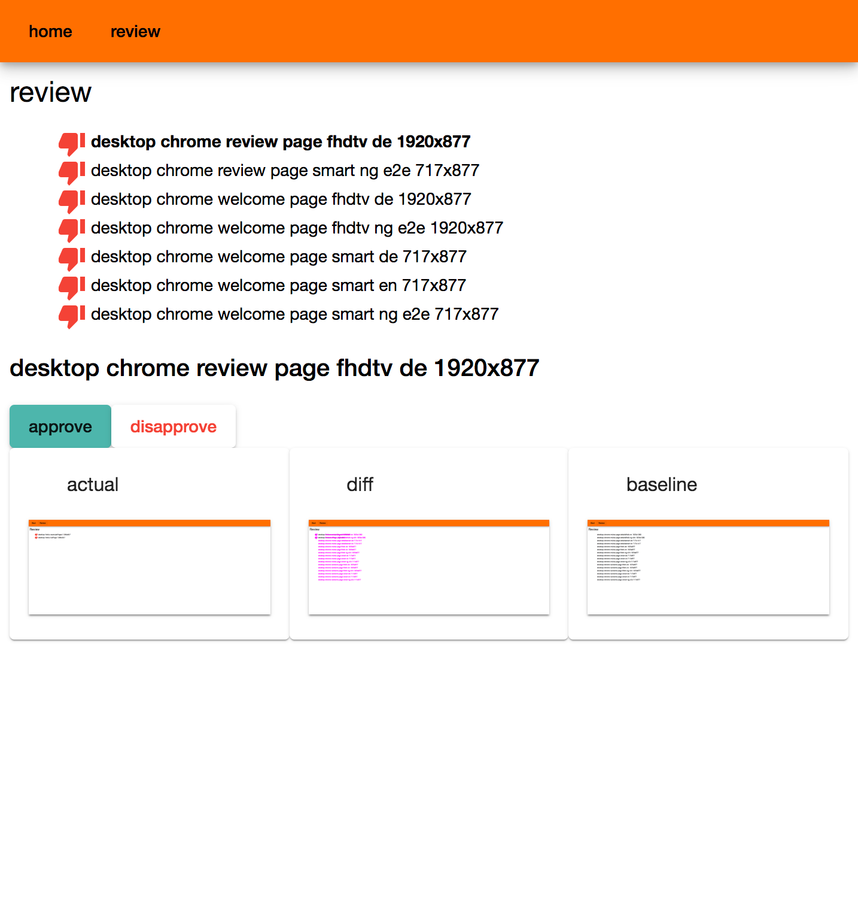

ng spec shot reviewer
=====================

support reviewing results of [protractor-image-comparison](https://www.npmjs.com/package/protractor-image-comparison) tests

usage:
```shell
npm i -g ng-spec-shot-reviewer
cd <root-of-your-project-with-test-results>
ng-spec-shot-reviewer
```
then open your browser at [http://localhost:8090/ssr-en](http://localhost:8090/ssr-en)




more description coming soon ...
